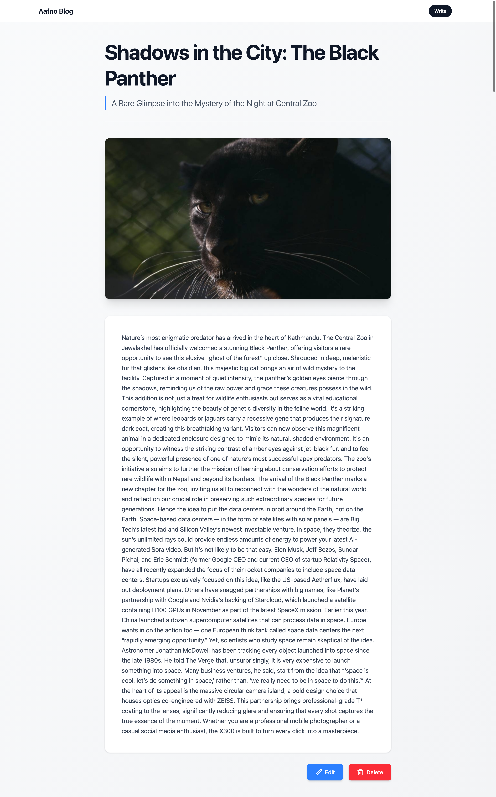
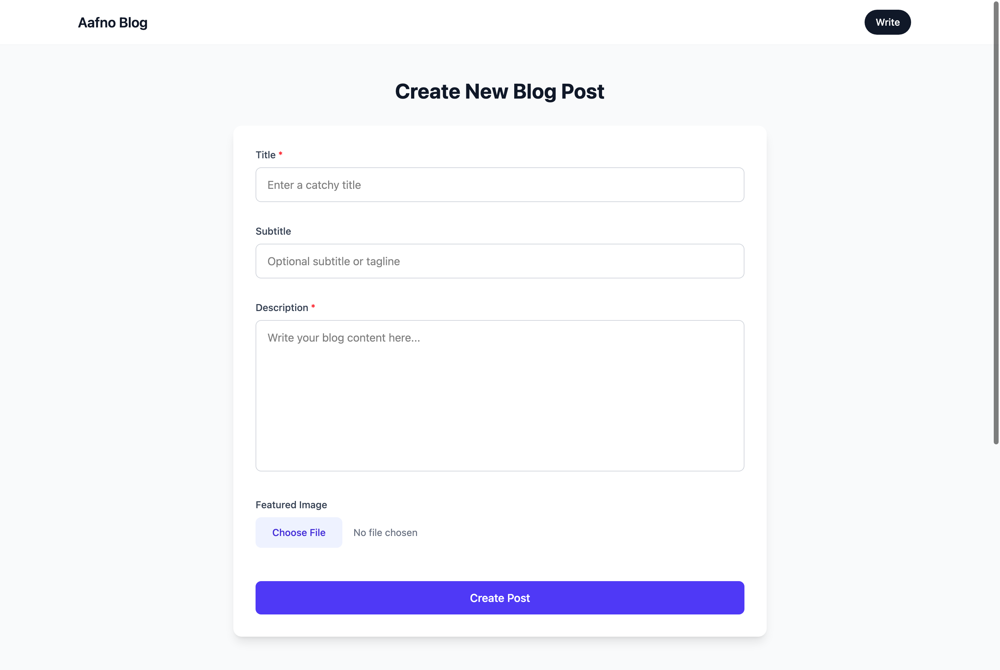

# 📝 Full Stack Blog Application

A modern blog application that enables users to create, edit, view, and delete blog posts through a clean and intuitive interface.

---

  
📸 Click to view project screenshots

  

     
    
    
<em>Homepage view</em>

    
    
<em>Blog post detail view</em>

    
    
<em>Admin writing dashboard</em>

  

---

## 🚀 Features

- ✍️ Create new blog posts
- 🛠 Edit existing blog posts
- 👀 View blog posts in a structured layout
- 🗑 Delete blog posts
- 📱 Responsive design for all screen sizes
- ⚡ Smooth and user-friendly UI

---

## 🛠 Tech Stack

- **Frontend:** HTML, CSS, JavaScript (React)
- **Styling:** Tailwind CSS / CSS
- **State Management:** React Hooks
- **Version Control:** Git & GitHub

---

## 🎯 Purpose of the Project

This project was built to practice and demonstrate:

- CRUD operations
- Component-based architecture
- State management in React
- Clean UI and responsive design
- Real-world project structure

---

## 📚 What I Learned

- Implementing Create, Read, Update, and Delete operations
- Managing application state effectively
- Handling forms and user input
- Writing reusable and maintainable components
- Improving UI/UX through responsive layouts

---

## 🔮 Future Enhancements

- User authentication and authorization
- Backend integration with database
- Rich text editor for blog content
- Comment and like functionality
- Search and filter blogs
